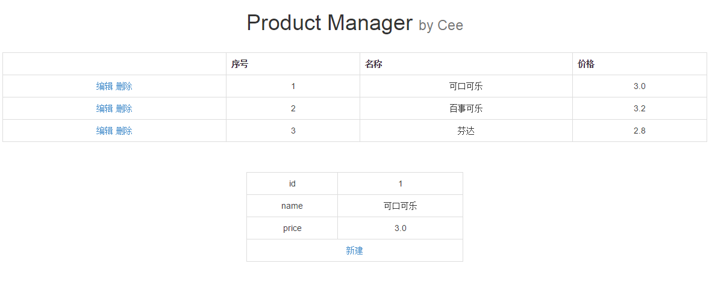
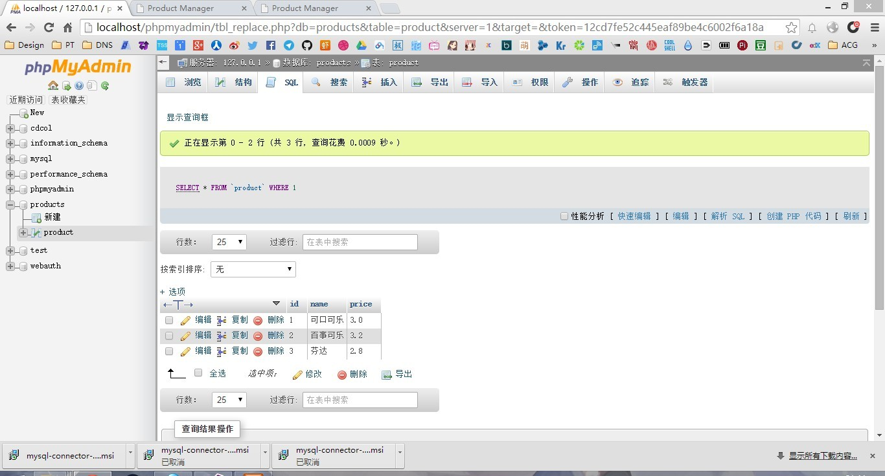

# Readme

## 运行截图

## 运行环境
- 装有.NET Framework 4.0或以上以及MySQL的电脑
- 最好是64位Windows系统
- 本程序在Windows 8.1 + VS2013 + .NET Framework 4.5上运行通过

## 实现过程
- 类似上一次的作业，采用`GridView`和`ObjectDataSource`绑定的方式，实现数据的呈现。通过设定中间体`ObjectDataSource`对`GridView`的四个函数`SelectMethod`，`UpdateMethod`，`InsertMethod`和`DeleteMethod`完成对返回数据的处理。`DetailView`用于添加数据。（默认显示第一行的数据）
- SQL部分使用MySQL提供的`MySQLConnector`完成。主要的语句为以下四条：

		String sqlSearch = "select * from product";
		String sqlInsert = "insert into product values (" + id + ", " + name + ", " + price + ")";
		String sqlDelete = "delete from product where id='" + id + "'";
		String sqlUpdate = "update product set name='" + name + "' , price='" + price + "' where id='" + id + "'";

## 其他问题
- 因为绑定了`GridView`和`DetailView`都绑定了`ObjectDataSource`。所以在没数据的时候会不显示任何的信息和数据，并且`DetailView`中无法添加数据。
- 考虑到所有的id都是主键，所以希望助教不要添加重复的id和编辑更改id的内容。

## 关于我
- 博客: [Cee‘s Home](https://chu2byo.me)
- Github: [Cee's Github](https://github.com/cirnocee)